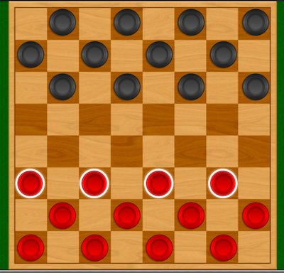

# Checker-Game-Design
## Let's Play Checkers

### Rules of the Game

Checkers is a two-person board game played on an 8x8 game board (same as chess board). Each player places their 12 pieces (usually red vs black) on the board on alternating dark squares in the three rows nearest to themselves. (See the following picture).



- At the start of the game, all pieces are "pawns", and can only move forward by 1 diagonal space at a time (on dark squares) toward the opponent's side of the board.
- If a piece player's piece is directly adjacent to an opponent's piece, it _may_ be able to "capture" the opponent's piece by jumping. 
- A pawn can only jump an opponent's piece when they are adjacent on a diagonal line, and the following space in the forward direction is unoccupied. Only one piece can be captured in a single jump; however, multiple jumps are allowed during a single turn, provided the condition of adjacency is met.
- Any time a move exists on the board where an opponent's piece can be captured, the player is required to jump and capture the piece.  
- Captured pieces must be removed from the board.
- When a piece reaches the furthest row away from the player who controls that piece, it is "crowned" and becomes a King. One of the pieces that have already been removed is stacked on the Pawn, indicating it is now a King. (Kings are twice as tall as Pawns).
- Unlike Pawns which may only move forward, Kings may move forward or backward (toward the controlling player) along the diagonal.
- Also unlike Pawns, a King may jump other players in either a forward or backward direction, in any combination.

1. A checker-bot wins the game according to the normal rules of the game (see above)
2. A checker-bot forfeits the game by making an illegal move, or when it's detected trying to cheat 
3. A checker-bot takes too long to decide which move to make


## Game Framework Implementation Details

1. I build a subclass of player named after me and my teammate. 
2. In the main.cpp file (provided), I create two instances of my player, and pass it to the `Game->run(p1,p2)` method to make them play against each other.
3. The checker-bot will decide what to do, and tell the game engine your decision by calling `movePieceTo()`. 
4. We have implemented dfs to find the double-jump in my turn.
5. If you want to implemented other bots under this framework, you can also build a subclass of player. Also, you can call 'Game->run(p1, p2)'
    in the main function to play against my player.
6. In the last of this ReadMe, I give directions of my player.


### Examining the gameboard

The `Game` object is passed to your `Player.takeTurn()` method call. During your turn, you can use the `Game` interface to determine what move you should make. The `Game` class offers the following methods:

```
    virtual size_t        countAvailablePieces(PieceColor aColor)=0;
    virtual const Piece*  getPlayerPiece(PieceColor aColor, int anIndex)=0;
    virtual bool          validLocation(const Location &aLocation)=0;
    virtual const Tile*   getTileAt(const Location &aLocation)=0;
    virtual bool          movePieceTo(const Piece &aPiece, const Location &aLocation)=0;    
```

You may be wondering, once you've examined the gameboard, how do you choose a move, given a set of possible moves?

You indicate your next move by changes interface provided by the `Game` class. Generally speaking, you'll inform the `Game` of your choice via the `movePieceTo()` method, and the `Game` will make necessary changes to the location and status of `Pieces` (for you _and_ your opponent). 

### The Neighborhood Function

A _neighbourhood function_ is a function that returns colection of the states that are considered 'adjacent' to your current state. An adjacent state can be obtained by making a single modification to the current state according to whatever rules are appropriate to your problem. So, for example, given any Pawn on the gameboard, it can move only two directions : forward left, or forward right (because Pawns only move forward, and all moves are diagonal). In theory you generally have two options, until you consider that your piece may be blocked from going one or both of those directions. 

As a simple algorithm to find options for your next move, your neighborhood function might do the following: 

1. For each piece, make a list of all possible moves (forward-left, forward-right, jump-left, jump-right, etc.)
2. Eliminate any non-viable option according to game rules. For example, a Pawn _can_ move left, but may be blocked and therefore this option would be eliminated. 

Now you have a ist of possible choices. But which choice is best?

### The Objective Function

An objective function indicates how 'close' a given option is to the optimal result. Sometimes your objective function knows exactly which is best, but it often just uses an approximation.

For example, consider the case where you have two Pawns that can move forward by 1 square. In a sense, these options appear to have exactly the same value. But what if one of your Pawns is only a square away from the back row of your opponent, where it can become a King. In this case, moving that piece produces a result of higher value to the outcome of your game (since Kings are more flexible and thus a much greater threat than Pawns). Between these two move options, the "move to become a King" has greater value, and is therefore ranked higher by your objective function.

### Indicating your decision

After considering all your available options for each of your remaining pieces, and optimizing the options according to the "value" of the outcome as determined by your objective function, you'll either have one "best" option, or multiple "equally good" moves. If you have a single "best" move, take it. Otherwise, either of the "good" moves will be fine. Note: In a future lecture, we'll discuss a predictive technique that can produce additional information to help prioritize moves of currently equal value. 

After careful evaluation of the current state of the gameboard, your checker-bot is required to indicate a decision. Do this by calling the `Game.movePieceTo(*Piece, Location)` method. 

If you are moving a piece, it is essential that you are moving a valid piece to a legally avalable location. If either condition is not met (and you get caught trying to cheat), your checker-bot will forfeit the game. 

If you are jumping an opponent's piece, it is essential that you are moving a valid piece, that you are legally jumping an adjacent piece of your opponent, and that you are landing on a legally available location. It's also worth noting that if you are jumping, it's possible to jump more than one `Piece` in a sequence. It is therefore allowable to call `Game.movePieceTo()` more than once (for your same `Piece`) in a single turn.

### Testing these players

During testing, your checker-bot will be playing against another instance of your own `Player`. If you like, you can create a second checker-bot that utilizes a different strategy and test against that. This approach may help you optimize your move decision algorithm.


## Algorithm we use.
### 1. Find the neighborhood for each piece(neighborhood function)


(1)For each piece, find a list of all the possible moves(forward-left, forward-right, jump-left, jump-right) determined on whether it is a king.(King can have more choices than pawn)

(2)Eliminate the moves that goes against the game rules(if the position to move is blocked or it°Øs outside of the bound of the checker board).

### 2. Objective function

All the pawns and kings mentioned below are pieces that can make valid move.

(1) For each piece, if any movement can jump over an opponent's piece, then jump it. If two different moves can jump over opponent's pieces, choose the one after the jump that would ends up in position nearest the upper bound(to become a king)


(2) For all the pieces, start from the one that is closest to becoming a king, check whether it can move and the movement won°Øt result in getting jumped by others. If the movement result in getting jumped by others, choose the one second nearest becoming a king. (If all movement can result in getting jumped by others, choose the movement that can lead to least number of possible jump by other player, if the number is same, choose the one that is nearest to become a king)

(3) If we already have a king, we still starts from all the pawns following the rules mentioned above. If all the movement can result in get jumped by others, then we consider to move a king. The king also follows the rule that not being jumped over. If all the movement including the king would result in get jumped, start from the pawn that closest to becoming a king.

(4) Do the above iteration until all the pawns have becomed kings. Then we move kings randomly only following the rule that not being jumped over by opponent's pieces(if it can jump over other players, the first choice is still to jump over others).

